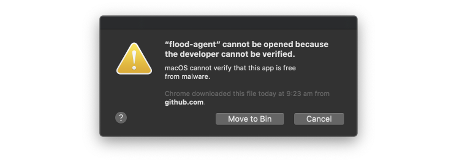
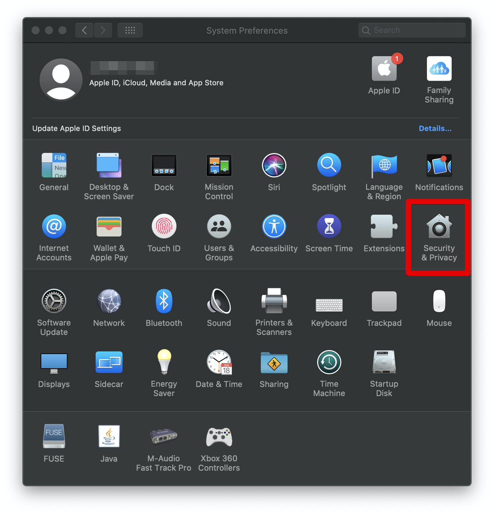
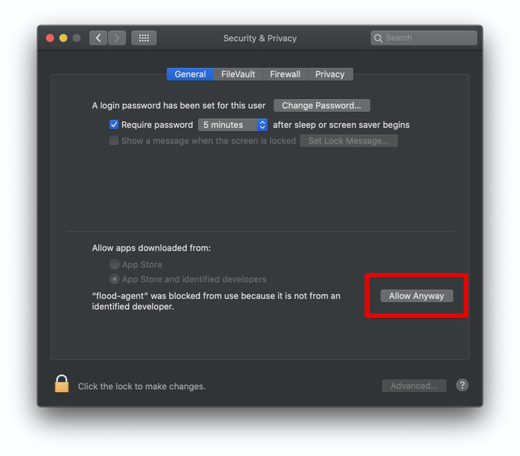
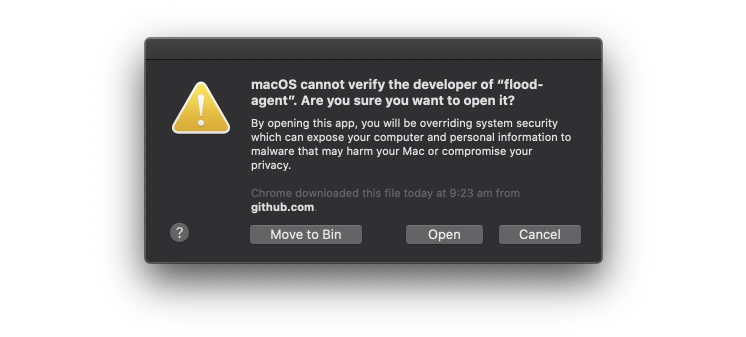

# Getting Started on macOS

In this guide we'll get Flood Agent running on your macOS computer.

The guide shows you how to run ad-hoc instances, suitable for exploration and prototyping floods. For production-scale installations please see [Running with systemd \(linux\)](deployment/running-with-systemd-linux.md).

## Download Flood Agent

Grab the latest binary from the [Flood Agent Releases page](https://github.com/flood-io/flood-agent/releases/latest). We recommend downloading the agent into its own directory. Once the binary has been downloaded, make it executable.


Flood Agent is pre-release software. Please select the latest release from the releases page and download the `flood-agent` macos binary under the **Assets** heading. Upon release we will update this page with a direct link to the correct binary.


Here are the steps above as you might use them via the terminal:

```text
mkdir -p ~/flood-agent
cd ~/flood-agent
curl -L https://github.com/flood-io/flood-agent/releases/download/v1.0-beta.11/flood-agent-v1.0-beta.11-macos-64bit \
    > flood-agent
chmod +x ./flood-agent
```

If you're having trouble starting Flood Agent on macOS Catalina, please see [macOS Catalina Notarization workaround](getting-started-on-macos.md#macos-catalina-notarization-workaround) below.


In the terminal, to run a binary from the current directory, don't forget the `./`

For example, to run Flood Agent: `./flood-agent`


## Decide how to run your load generator

From here you need to decide whether you want to run your load generator as a Docker container, or from a local installation of JMeter or Gatling.

* To use flood's load generator docker images see [Getting Started - Docker](getting-started-docker.md)
* To use a locally JMeter or Gatling installation see [Getting Started - Local JMeter & Gatling](getting-started-local-jmeter-and-gatling.md)

Docker is a good option if you'd like to

* try out [Flood](https://flood.io) with a minimum of setup.
* get up and running quickly and are happy to use default configuration.
* start prototyping & tuning load test plans.
* use Flood Agent with a load generator not yet supported as a local installation \(Flood Element & Selenium\)

Alternatively, using a locally installed load generator is a good option to

* operate in environments where docker is not available or not allowed.
* apply custom libraries and configuration.
* reuse existing resources.

### macOS Catalina Notarization workaround

Using `flood-agent` on macOS Catalina requires a workaround for the new "notarization" feature.

Notarization is designed to protect Mac users from malicious software. While we support this initiative, it will take us some time to integrate with `flood-agent`. Until then, please follow these steps when getting started.

For more information about notarization please see the [Apple documentation](https://support.apple.com/en-us/HT202491).

1. When you first run `flood-agent` you'll see a dialog like this:




2. Hit _Cancel._

3. Open _System Preferences_ and go to _Security & Privacy._



4. Look for the text explaining that "flood-agent" was blocked from use. Click _Allow Anyway._



5. Run `flood-agent` again and you should see another dialogue like this:



6. Click _Open._ `flood-agent` should now start!

