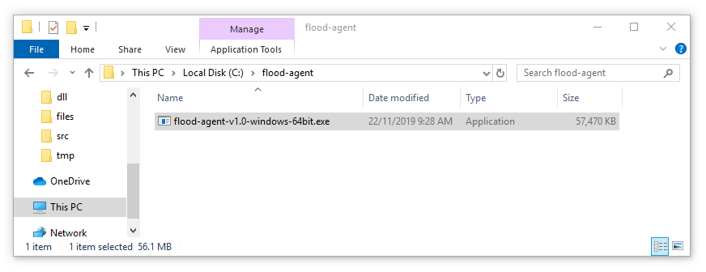

# Getting Started on Windows

## Download and Install

The guide shows you how to run ad-hoc instances, suitable for exploration & prototyping floods. For production-scale installations see [Running with NSSM \(Windows\)](deployment/running-with-nssm-windows.md).

## Download

Grab the latest binary from the [Flood Agent Releases page](https://github.com/flood-io/flood-agent/releases/latest). We recommend downloading the agent into its own directory.

Download: [flood-agent v1.0 64bit for Windows](https://github.com/flood-io/flood-agent/releases/download/v1.0/flood-agent-v1.0-windows-64bit.exe)

For the guide, let's assume you've chosen to use `c:\flood-agent`:


In the guide we refer to`flood-agent.exe` but when you download it the file name will look like `flood-agent-v1.0-windows-64bit.exe`. 

The actual name of the binary doesn't matter, so please either rename the binary to `flood-agent.exe` or substitute the filename given in the examples.



In the console, to run a binary from the current directory, don't forget the `.\`

For example, to run Flood Agent it would be`.\flood-agent.exe`


## Preparing the load generator

To start running load tests with Flood Agent, you must first prepare the load generator.

On Windows we support JMeter and Gatling, either by adding a Flood plugin to your existing installation, or by using one of our pre-built bundles.

For detailed instructions, take a look at [Getting Started - Local JMeter & Gatling](getting-started-local-jmeter-and-gatling.md)

