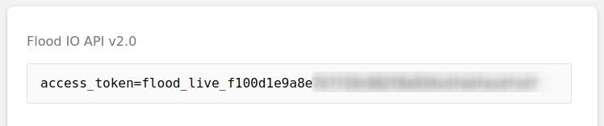
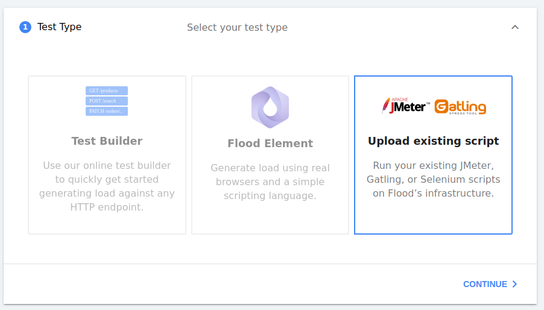

# Getting Started \(Windows\)

The guide shows you how to run ad-hoc instances, suitable for exploration & prototyping floods. For production-scale installations see [Running with NSSM \(Windows\)](deployment/running-with-nssm-windows.md).

## Download


_Please note:_ until the first official release please grab the latest _pre-release_ from the [GitHub Releases page](https://github.com/flood-io/flood-agent/releases/)


We recommend downloading the agent into its own directory. For the guide, let's assume you've chosen to use `c:\flood-agent`:


## Firewall preparation

Ensure that your machine has network access to the following endpoints 

* https://drain.flood.io
* https://beacon.flood.io
* https://vault.flood.io
* https://flood-archives.s3-accelerate.amazonaws.com
* https://logs.us-east-1.amazonaws.com
* https://sns.\*.amazonaws.com
* https://sqs.\*.amazonaws.com

On Windows you may also have to allow processes access to the outside world when a Flood starts.

## Flood API Token

Grab your Flood API token from [https://app.flood.io/account/user/security](https://app.flood.io/account/user/security)




Your access token is the part after `access_token=`


## Configure the agent

Create a configuration file `c:\flood-agent\config.yaml` with the following contents:



```yaml
flood_api_token: flood_live_f100d1e9a8e # as grabbed above
grid_name: windowsgrid1
tools:
  jmeter:
    jmeter_home: C:\Path\To\JMeter
```




If your `jmeter_home` path contains a space, make sure you escape it with a backslash `\` before each space.


## Run the agent

In a console, run

```text
cd c:\flood-agent
flood-agent.exe --config config.yaml
```

Your agent will start, outputting some informational logging. The agent is organised into the flood grid `windowsgrid1`

If you perform the above on a second machine, your grid `windowsgrid1` will now have two nodes. Any floods scheduled onto `windowsgrid1` will now run on both machines.

## Run a flood

Create a flood as normal \(or Start more like this\)



progress through the steps until Step 6, where you'll choose `windowsgrid1` .


Launch the test.

### Shut down and cleanup


There are no manual cleanup steps required.


Your Flood Agent instance will check in every few seconds to notify Flood that it is alive. If you stop the process or disconnect from the internet/close your laptop, it will be removed from Flood after 1 minute. You can reconnect it at any time.

