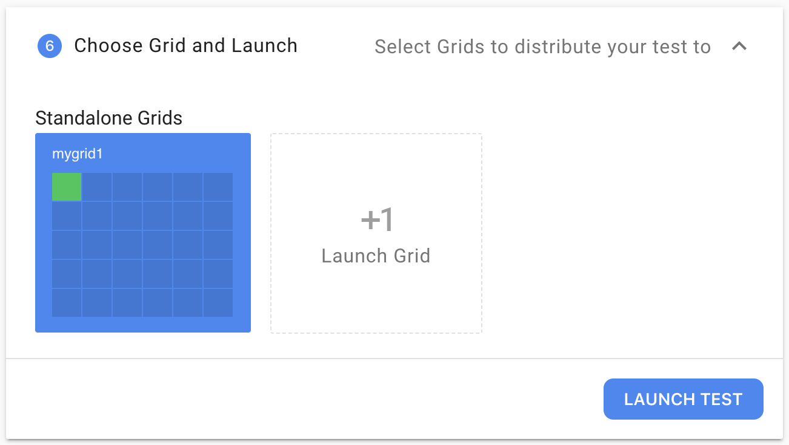

# Getting Started \(macOS & Linux\)

In this guide we'll get Flood Agent running on your Mac or Linux computer.

The guide shows you how to run ad-hoc instances, suitable for exploration & prototyping floods. For production-scale installations see [Running with systemd \(linux\)](deployment/running-with-systemd-linux.md).

## Download

Grab the latest binary for linux from the [flood-agent releases page](https://github.com/flood-io/flood-agent/releases/latest).

We recommend downloading the agent into its own directory:

```text
mkdir -p ~/flood-agent
cd ~/flood-agent
curl -L https://github.com/flood-io/flood-agent/releases/download/v1.0-beta.0/flood-agent-linux-1.0-beta.0 \
    > flood-agent
chmod 0755 ./flood-agent
```

## Flood API token

Grab your Flood API token from [https://app.flood.io/account/user/security](https://app.flood.io/account/user/security)


## Run the agent using Flood's docker tool images

If you have docker installed, you can run `flood-agent` without any further configuration:

```text
./flood-agent --token flood_live_f100d1e9a8e # as grabbed above
```

Without explicit configuration Flood Agent will 

* select a random grid name like `submerged-dolphin`
* will use the latest versions of flood's docker load generator images \(e.g. `floodio/jmeter`\)

However, you may wish to configure `flood-agent` explicitly

* to use a local installation of JMeter or Gatling.
* to restrict which tools this `flood-agent` can run.
* as an alternative to specifying command-line flags.

If you're running `flood-agent` from within a corporate network, you may need to perform additional steps to get started. For more information, please see the [Networking](deployment/networking.md) page.

## Configure the agent

The simplest method for creating a configuration file is the guided `flood-agent.exe configure` wizard.

Otherwise,  create a configuration file yourself at `~/flood-agent/confg.yaml` with the following contents:

```text
flood_api_token: flood_live_f100d1e9a8e # as grabbed above
tools:
  jmeter:
    jmeter_home: /path/to/jmeter_home
```

## Check your configuration

Next, check the configuration:

```text
./flood-agent check

~# Flood Agent #~ : configuration checker
[>] config read from /home/user/flood-agent/config.yaml

==> Checking Flood API
[√] api token - ok

==> Checking tools
[√] jmeter - ok
[ ] no gatling config
[ ] no flood-element config

==> Checking network
[√] AWS S3 Archives endpoint - connectivity ok
[√] Flood configuration service - connectivity ok
[√] Flood data pipeline ingress - connectivity ok
[√] Flood status service - connectivity ok
[√] AWS sns endpoint in us-east-1 - connectivity ok
[√] AWS sqs endpoint in us-east-1 - connectivity ok
```

Again, if you're running `flood-agent` from within a corporate network, you may need to perform additional steps to get started. For more information, please see the [Networking](deployment/networking.md) page.

## Run the agent

```text
./flood-agent --grid mygrid1
```

Your agent will start, outputting some informational logging:

```text
~# Flood Agent #~
==> Contacting Flood API...
--> checking Flood API token
[√] token valid
--> syncing with API as mygrid1
[√] sync done
==> Bootstrapping Flood agent...
[2s] ~ starting Flood Agent ~ version: dev build: dev
[5s] Using stdout-only logs
[5s][mygrid1] 
[5s][mygrid1] load generator config summary
[5s][mygrid1] java-selenium-firefox:
[5s][mygrid1]   as docker container
[5s][mygrid1] jmeter:
[5s][mygrid1]   as docker container
[5s][mygrid1] gatling:
[5s][mygrid1]   as docker container
[5s][mygrid1] floodchrome:
[5s][mygrid1]   as docker container
[5s][mygrid1] floodelement:
[5s][mygrid1]   as docker container
[5s][mygrid1] java-selenium-chrome:
[5s][mygrid1]   as docker container
[5s][mygrid1] 
[8s][mygrid1][agent] ready, awaiting Flood jobs
[8s][mygrid1][job-worker] awaiting next job
```

The agent is organised into the flood grid `mygrid1`


**If you perform the above on a second machine, your grid `mygrid1` will now have two nodes. Any floods scheduled onto `mygrid1` will now run on both machines.**


For more information on how it works, please see [How it works](how-it-works.md).

## Run a flood

Create a flood as normal \(or Start more like this\)


progress through the steps until Step 6, where you'll choose `mygrid1` .



Launch the test.

## Shutting down

Your Flood Agent instance will check in every few seconds to notify Flood that it is alive. If you stop the process or disconnect from the internet/close your laptop, it will be removed from Flood after 1 minute. 

You can reconnect it at any time.

