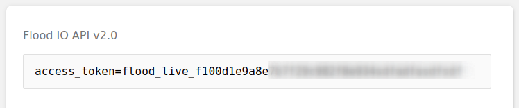
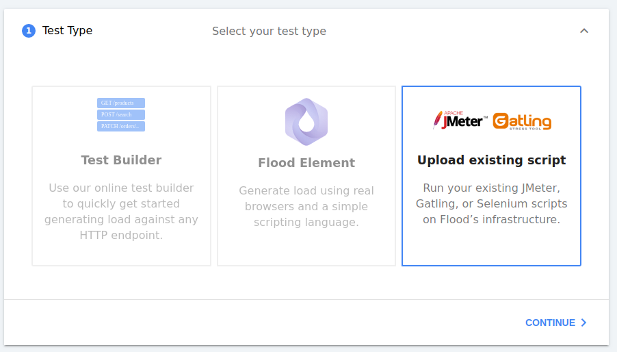

# Getting Started \(macOS & Linux\)

In this guide we'll get Flood Bare Metal Agent running on your Mac or Linux computer.

The guide shows you how to run ad-hoc instances, suitable for exploration & prototyping floods. For production-scale installations see [Running with systemd \(linux\)](deployment/running-with-systemd-linux.md).

## Download


_PLEASE NOTE - until the first official release please grab the latest pre-release from_ [_https://github.com/flood-io/flood-agent/releases/_](https://github.com/flood-io/flood-agent/releases/tag/v1.0-beta.0)\_\_


Grab the latest binary for linux from the [flood-agent releases page](https://github.com/flood-io/flood-agent/releases/latest).

We recommend downloading the agent into its own directory:

```text
mkdir -p ~/flood-bare-metalcd ~/flood-bare-metalcurl -L https://github.com/flood-io/flood-agent/releases/download/v1.0-beta.0/flood-agent-linux-1.0-beta.0 \    > flood-agentchmod 0755 ./flood-agent
```

## Firewall preparation

Ensure that your machine has network access to the following endpoints 

* https://drain.flood.io
* https://beacon.flood.io
* https://vault.flood.io
* https://flood-archives.s3-accelerate.amazonaws.com
* https://logs.us-east-1.amazonaws.com
* https://sns.\*.amazonaws.com
* https://sqs.\*.amazonaws.com

## Flood API token

Grab your Flood API token from [https://app.flood.io/account/user/security](https://app.flood.io/account/user/security)



## Configure the agent

You can use the in-built `configure`command to easily setup your `config.yaml`file - simply use `./flood-agent configure`to start the configuration wizard.

or you can create a configuration file `~/flood-agent/config.yaml` manually with the following structure and contents:

```text
flood_api_token: flood_live_f100d1e9a8e # as grabbed abovegrid_name: mygrid1tools:  jmeter:    jmeter_home: /path/to/jmeter_home
```

## Run the agent

```text
./flood-agent --config config.yaml
```

Your agent will start, outputting some informational logging. The agent is organised into the flood grid `mygrid1`


**If you perform the above on a second machine, your grid `mygrid1` will now have two nodes. Any floods scheduled onto `mygrid1` will now run on both machines.**


## Run a flood

Create a flood as normal \(or Start more like this\)



progress through the steps until Step 6, where you'll choose `mygrid1` .


Launch the test.

