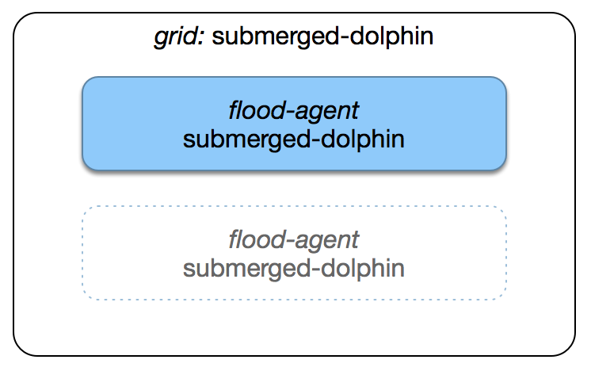
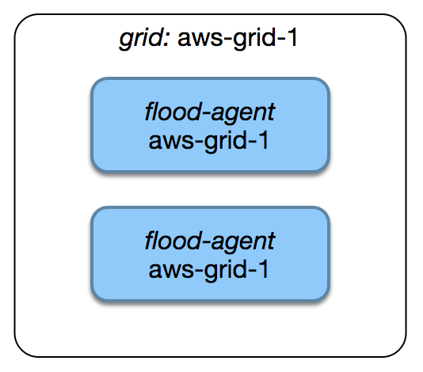
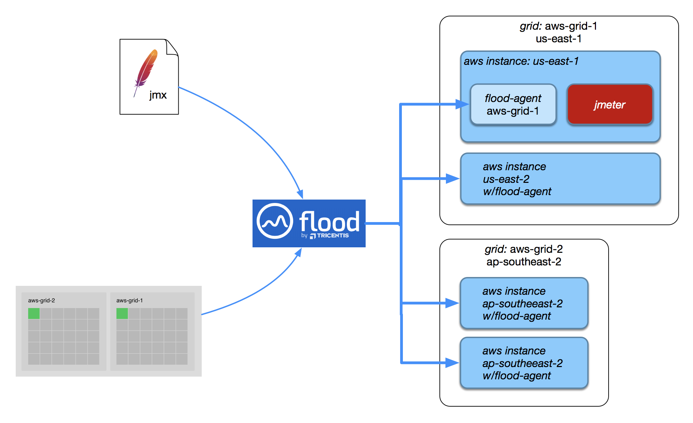

# How it works

## Getting to know the components

### Grids

A "grid" is a group of flood agents running on any type of computer \(for example a laptop or a cloud-managed VM instance\).

#### Agents with the same name are part of the same grid

If you're working on a single machine \(your laptop for example\) you can let flood-agent pick a random name like `submerged-dolphin`



Say you'd like to run a larger grid. You could run `flood-agent` on a second machine

```text
./flood-agent --grid submerged-dolphin
```

However, in this case it'd just be easier to start both agents with a grid name of your choosing:



```text
# ec2 instance 1
aws-ec2-1 $ ./flood-agent --name aws-grid-1

# ec2 instance 2
aws-ec2-2 $ ./flood-agent --name aws-grid-1
```

#### Machines running in the same Grid should be homogeneous \(though it isn't mandatory\)

For example, using a laptop and an extra-large VM instance as part of the same grid would make test results difficult to interpret and trust.

### Floods

A **flood** is an instance of a load **test plan**. To run a load test, a **flood** is scheduled onto one or more **grids**. 

So, when you run a **flood**, it ends up running on all the `flood-agent` instances running within the **grids** you have organised and selected:




