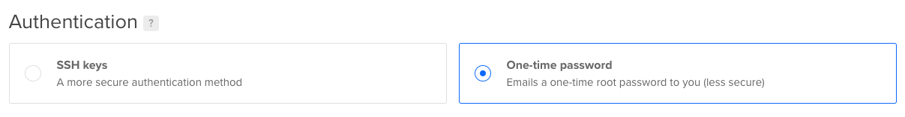

# Setting up Flood Agent with Digital Ocean

## Requirements

* Digital Ocean account access
* Apache JMeter 5.1.1
* Java 1.8

## Planning and Configuring the Droplet

Digital Ocean comes with a large range of Droplet sizes available. Choosing the right one to service the amount of concurrency you wish to generate takes a little planning and some 'trial and error'.

Typically load generators \(using tools such as JMeter\) are primarily memory-bound, followed closely by CPU.  It also highly depends on what your virtual users are doing within your script so having ample amounts of both will definitely help accomodate user concurrency in your load test.

For the purposes of this guide - we'll only be looking at a fairly mid-spec'd Droplet however the installation steps no matter what Droplet size you choose will be practically identical.

## Choosing a Linux distribution

Digital Ocean support a bunch of Linux distributions - we'll go ahead and choose Ubuntu 18.04 for general ease of use in this guide.

## Choosing the droplet size

As previously mentioned we'll choose one of the new Memory-Optimized Droplets being offered.

## Choosing the datacenter region

It is fairly important to choose the region based on where your users will realistically be originating from for your production environment. Having a load generator node in a different region will impact latency when it's time to run your test which will most likely translate to higher-than-expected user response times.

For this guide we'll choose the **New York** datacenter.

We'll also go ahead and select the **Monitoring** additional option so we can keep an eye on the resource utilization when we are running a load test with this Droplet.

## Setting up authentication

In this configuration section, we'll go ahead and choose to use the One-time password \(strictly for the purposes of this guide\). 

It is highly recommended to use SSH keys as it is a more secure method for accessing your Droplet.

## Creating your new droplet

Once you are happy with the aforementioned options - go ahead and Create the Droplet and wait until it is available.

## First steps to setting up the Flood Agent

Once you have been able to access your new Droplet - it's important to do some initial housekeeping tasks before we get underway in installing the Flood Agent.

Makes sure your droplet has the latest `apt-get` install packages. Type the following to do this:

`sudo apt-get update` 

`sudo apt-get upgrade` 

Now we'll need to download the latest Flood Agent release from this page: [https://github.com/flood-io/flood-agent/releases](https://github.com/flood-io/flood-agent/releases)

But firstly, we'll create a `flood-agent` directory to put all of our related files in.

`mkdir ~/flood-agent`

`cd flood-agent`

Download the latest Flood Agent build using `wget`

`wget https://github.com/flood-io/flood-agent/releases/download/v1.0-beta.9/flood-agent-linux-1.0-beta.9`

`mv flood-agent-linux-1.0-beta.9 flood-agent` 

`chmod 0755 flood-agent` 

Now you have the Flood Agent setup on your new Droplet!

## Configuring the Flood Agent with JMeter

Since we want to use Apache JMeter with this Flood Agent installation - we'll need to first install Java which is required for JMeter to run.

You can easily do this by running `sudo apt install default-jre` 

Once installed check that it is available by running `java -version` which should report back the Java version that just got installed.

Now for JMeter, we want to install the latest version as of this guide \(5.2\) - that can be downloaded from here: [https://jmeter.apache.org/download\_jmeter.cgi](https://jmeter.apache.org/download_jmeter.cgi)

We can download this tool in the root user home directory as a new directory will be created once the download archive is extracted.

`cd ~`

`wget http://apache.mirror.digitalpacific.com.au//jmeter/binaries/apache-jmeter-5.2.zip` 

`apt install unzip`

`unzip apache-jmeter-5.2.zip`

`rm -rf apache-jmeter-5.2.zip` 

We now have a fresh JMeter install in the root home directory at `~/apache-jmeter-5.2`

In order for JMeter to work successfully with Flood Agent we'll need to put two Flood Agent related plugins into the `lib/ext` folder within the JMeter installation directory.

`cd ~/apache-jmeter-5.2/lib/ext/` 

`wget https://github.com/flood-io/flood-agent/releases/download/v1.0-beta.9/flood-jmeter-5.1.1.jar`

`wget https://github.com/flood-io/flood-agent/releases/download/v1.0-beta.9/json-simple-1.1.1.jar`  

Once this has been done we can go back to the Flood Agent directory and finalize our installation.

## Running the Flood Agent configuration wizard

We've built the `configure` command that lets you create a `config.yaml` file via the CLI instead of creating one in a text editor.

You will need your Flood API key which is available when you login to the Flood web application, select API Access from the user menu.

Copy the API token `flood_live_123xxxxxxxxxxx` and run `cd ~/flood-agent` 

To start the `configure` wizard - type `./flood-agent configure` 

Enter the API token when it asks for you to do so.

The next step is to specify where our new Apache JMeter installation lives.

Enter the path when asked to `~/apache-jmeter-5.2` 

You can say **No** to setting up other tools such as Gatling for this example. Select **Yes** when asked to write the new configuration file.

## Running the Flood Agent

Once your `config.yaml` file and JMeter tool are setup - we can now go ahead and run the agent itself.

`cd ~/flood-agent` 

`./flood-agent` to run the agent on your new load generator node.

You should see something similar to the following output:

If you see something similar - Congratulations! you are now ready to run a JMeter load test using this load generator.

Once logging in back to the Flood web application - you should see your new load generator node visible in the Grids page as follows:

When setting up a new load test - you will have the ability to select this Grid to run your tests with.

