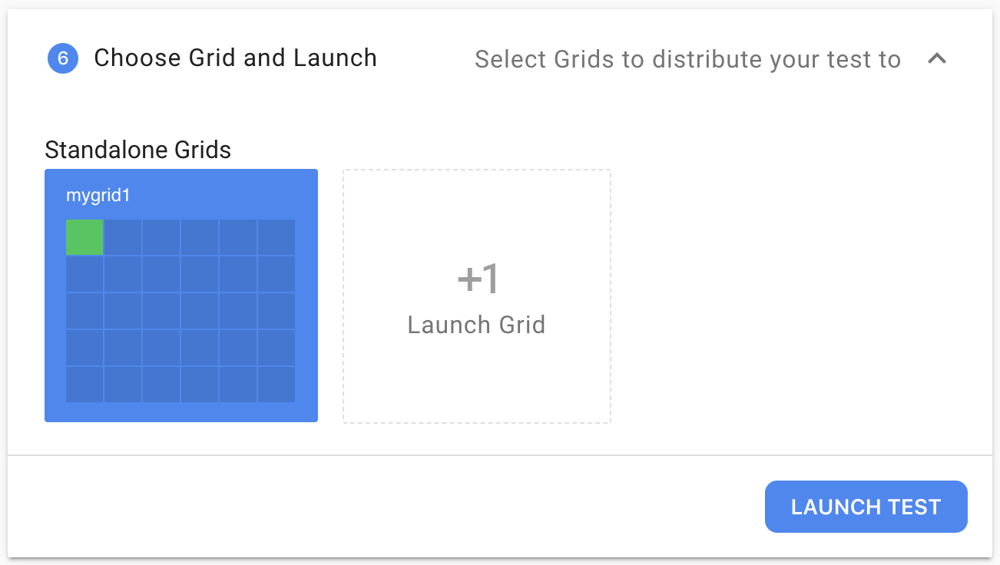

# Running a Flood

Create a flood as you would normally \(or choose _Start more like this_ from a Flood's action menu\)

Progress through the steps until Step 6, where you'll choose the grid you started. In the image below it's `mygrid1`

Launch the test.

